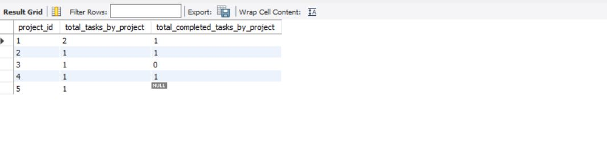
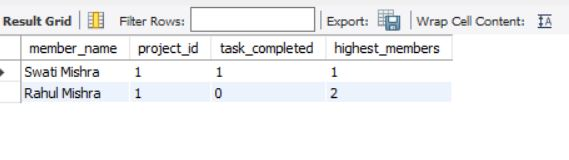
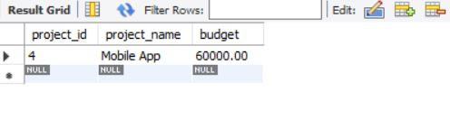
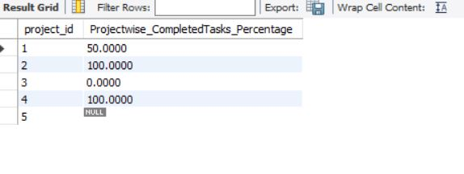
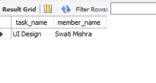
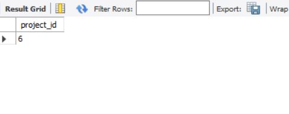
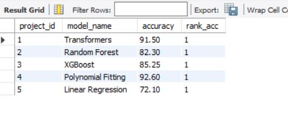

# Project_Info SQL Assignment

## 📘 Introduction

This repository presents an SQL-based project schema designed to simulate real-world project management scenarios using MySQL. The focus is on interlinked data modeling and query optimization, including complex joins, subqueries, window functions, and Common Table Expressions (CTEs). The work was carried out in **MySQL Workbench**, and schema visualization helped map relationships among projects, teams, and tasks.

---

## 📁 Database Schema

### 🏗️ 1. Projects Table

| Column       | Type        | Description                        |
|--------------|-------------|------------------------------------|
| project_id   | INT         | Primary key                        |
| project_name | VARCHAR(255)| Name of the project                |
| budget       | DECIMAL     | Project budget                     |
| start_date   | DATE        | Project start date                 |
| team_id      | INT (UNIQUE)| Foreign key (linked to Teams)      |

### 📝 2. Tasks Table

| Column         | Type         | Description                              |
|----------------|--------------|------------------------------------------|
| task_id        | INT          | Primary key                              |
| task_name      | VARCHAR(255) | Task description                         |
| member_name    | VARCHAR(100) | Assigned member                          |
| due_date       | DATE         | Task deadline                            |
| task_completed | BOOLEAN      | Task status (TRUE/FALSE/NULL)            |
| project_id     | INT          | Foreign key (linked to Projects)         |

### 👥 3. Teams Table

| Column      | Type         | Description                         |
|-------------|--------------|-------------------------------------|
| member_id   | INT          | Team member ID                      |
| member_name | VARCHAR(100) | Name of the team member             |
| role        | VARCHAR(100) | Team member role                    |
| team_id     | INT (PK/FK)  | Primary key and FK (linked to Projects) |

### 📊 4. Model_Training Table

| Column        | Type         | Description                       |
|---------------|--------------|-----------------------------------|
| training_id   | INT          | Primary key                       |
| project_id    | INT          | Foreign key (Projects)            |
| model_name    | VARCHAR(100) | Name of the AI model              |
| accuracy      | DECIMAL(5,2) | Accuracy score of the model       |
| training_date | DATE         | Model training date               |

### 🗂️ 5. Data_Sets Table

| Column        | Type         | Description                      |
|---------------|--------------|----------------------------------|
| dataset_id    | INT          | Primary key                      |
| project_id    | INT          | Foreign key (Projects)           |
| dataset_name  | VARCHAR(255) | Dataset title                    |
| size_gb       | DECIMAL(5,2) | Size in GB                       |

This project demonstrates SQL query writing, data handling using relational schemas, and report generation. 
We worked with three main tables: **Projects**, **Tasks**, and **Teams**, and also included **Model_Training** and **Data_Sets** as per the extended queries.

## Tables Used

- **Projects**: Stores project metadata.
- **Tasks**: Contains information about tasks, their completion status, and deadlines.
- **Teams**: Maps team members and their roles to projects.
- **Model_Training**: Tracks AI models and their accuracy per project.
- **Data_Sets**: Contains dataset size and update information per project.

---

## Sample SQL Outputs

### 1. Total and Completed Tasks by Project

### 2. Project-wise Member Ranking by Task Completion

### 3. Project(s) with Maximum Budget

### 4. Task Completion Percentage per Project

### 5. Team Leads Working on Tasks with Due Date Offset

### 6. Projects Without Any Task Assigned

### 7. Highest Accuracy AI Models per Project

---

## Conclusion

In this assignment, I:

- Designed relational tables with appropriate constraints.
- Used **joins**, **window functions**, **subqueries**, and **CTEs** effectively.
- Practiced data analysis using SQL constructs such as `RANK()`, `ROW_NUMBER()`, `JOIN`, `GROUP BY`, `CASE`, and aggregation functions.

The queries were validated using MySQL Workbench, and screenshots of the results were collected.

| last_updated  | DATE         | Last modification date           |

---
